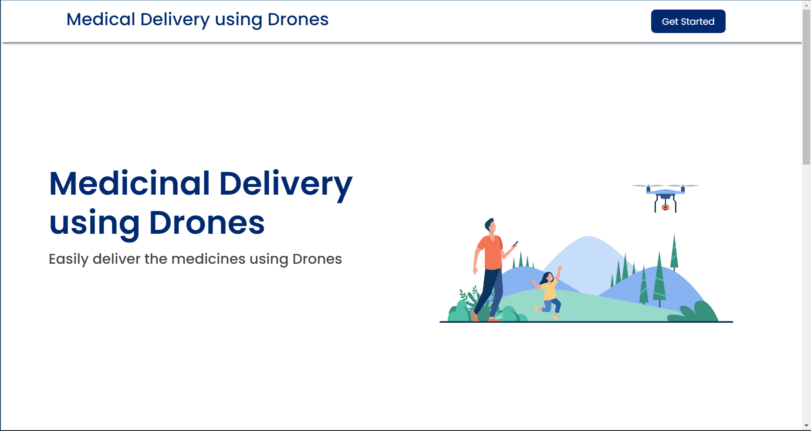
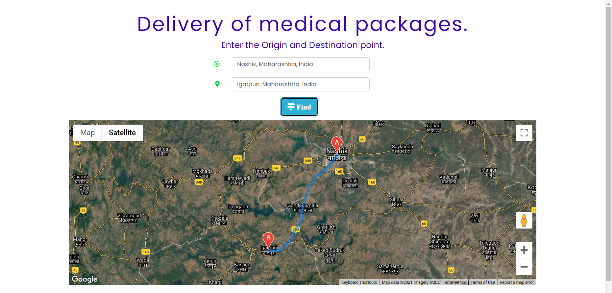
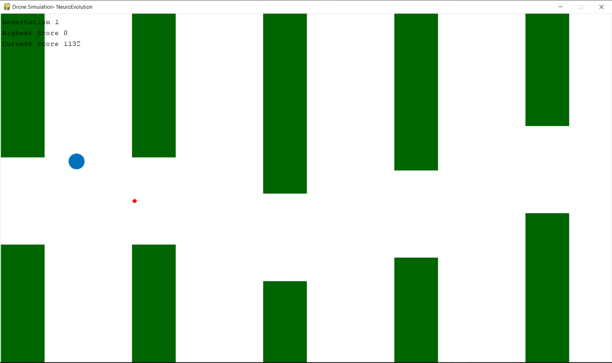
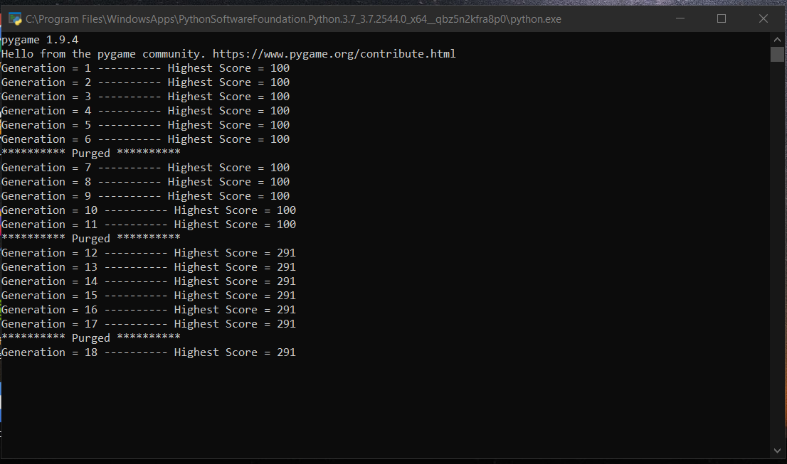

# Delivery of Essential Medicines by Drones in Hilly areas.

Delivery of Medical equipments with the help of drones in Hilly terrain using Unsupervised Machine Learning and Google map APIs

--- 

## Getting Started

This is a web interface for medical equipment delivery system in the hilly terrain.

- When you click the `Get Started` button, you will get redirected to the interface where you can enter the Start point and the end point for the delivery drone.

- This map interface shows you the distance between the two locations and the time required for the drone to travel the distance.

- The [drone-simulation-path](drone-path-simulation/) contains the model that explains how the delivery drones will takle the real life obstacles using the unsupervised training method used to train the drones.

- The insight is taken from the unsupervised model of the flappy bird game which learns how to avoid the obstacles over the iterations.

- Finally, the drone path simulation model can then be integrated with the map API and then we can use the integrated model for the real-life problems. 

> Note:- There is a lot of future scope to further develop the project.
